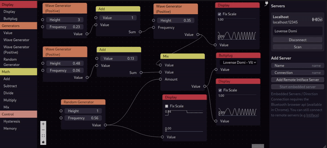

    

Node-based visual editor for _adult_ entertainment. This is inspired by [buttplug-editor](https://github.com/MaidKun/buttplug-editor).

This webapp enables you to create node-based programs and patterns for a variety of Toys which are compatible with the [Buttplug.io Protocol](https://buttplug.io/).

## Features

- Connectivity
  - Connect using your Browsers Bluetooth (Chrome only)
  - Connect using a remote server, e.g running [Intiface](https://intiface.com/)
  - Connect to multiple servers (but i am indeed curious about the use-cases of this...)
  - Support for advanced Toys that have multiple actuators (Support for rotators and linear actuators is currently incomplete but probably usable)
  - (Planned) Connect to more than just your toys (like lights, video playback, ...) to create a truly extravagant experience
- Extensible Architecture
  - It is easy to add new nodes - maybe sometime in the future there will even be a plugin system, so you can unleash your creativity.
- Pretty nice UX
  - The Interface is inspired by the Blender node-editor.
- Complex and event based flows (Planned)
  - Use triggers, switches, randomizers and conditionals to create complex structures, that are more "intelligent" than a simple pattern and react dynamically to sensors or time.

> As this is small a side project of mine I am very happy to accept pull requests for bugfixes or features. However at the current state the code is a bit messy and I plan to change a lot of the internals, so coordination via Issues/Discussions will probably be helpful.
> I'd love to hear from You!

 — Luna the Bat

# Contributing

I don't really expect a lot of traffic here, so feel free to create Discussion threads or Issues for whatever you want. But please adhere to our [Code of Conduct](CODE_OF_CONDUCT.md) and be

- Nice and respectful to everyone (where 'everyone' should be understood in the most inclusive sense possible)
- aware that github has no age-restriction - so **be responsible** with what you write. Things that I deem too explicit will be removed. If you plan to interact with this project, I strongly recommend to read the [Github After Dark](https://buttplug-developer-guide.docs.buttplug.io/intro/buttplug-ethics.html#github-after-dark) section of buttplug.io.

Fun is sure a nice thing, but we may in no case forget to be responsible with what we do.
